# BIG BATTLES · معارك كبيرة

**SMALL HEROES • BIG BATTLES — أبطال صغار • معارك كبيرة**

A lightweight, original Saudi-inspired chibi crowd runner using vanilla ES modules and Three.js. Touch once, drag left/right; movement forward, targeting and combat are automatic. One stage, no account/backend/shop, joystick, shooting button or gameplay menus.

## لمّتنا — صالة المرح (Lammatna)

The Babylon.js family playground game moved to its own repository: [3wasfnjd/lammatna](https://github.com/3wasfnjd/lammatna) (https://3wasfnjd.github.io/lammatna/).

## Defence mode (Mob Control style) — 2026-09-28 (default)

The game now plays like Mob Control: **your army holds its line and only slides left/right**. Enemy hordes, gates, barrels and giants come toward it. The earlier forward runner is kept at `?mode=runner`.

| Gates | Horde | Golem (stage 2) | Boss (stage 3) |
| --- | --- | --- | --- |
| 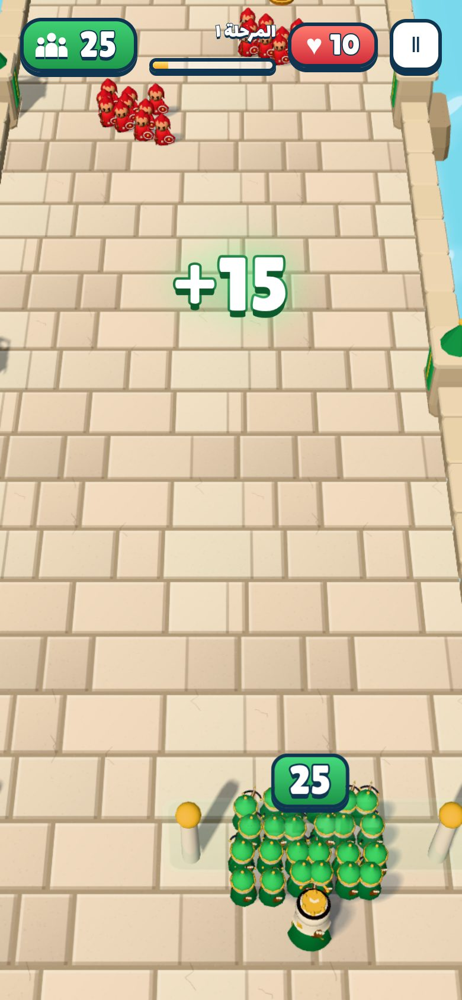 | 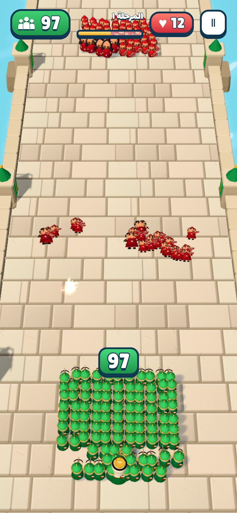 | 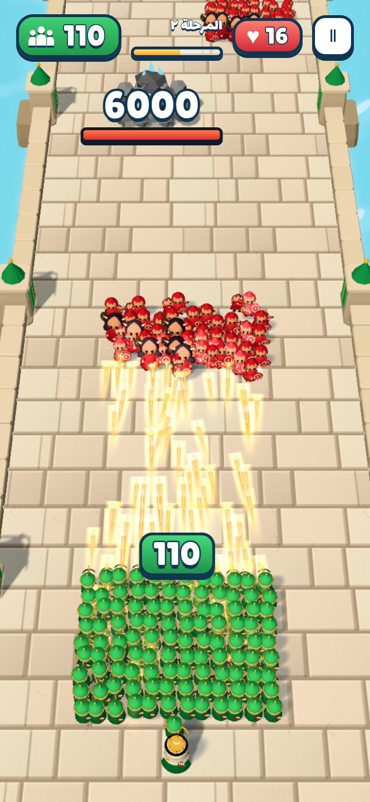 | 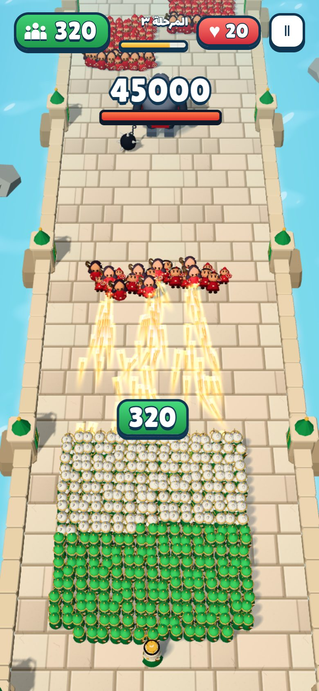 |

- **Rules** (`src/core/DefenseSimulation.js`): soldiers auto-fire at enemies in range (17 m). A walker that reaches the line dies and takes a soldier with it (a horned brute takes three). A walker that slips past the army costs castle hearts (brute: 3). Defeat when the army or the castle falls. Hordes drift toward the army when close, so dodging never fully avoids them.
- **Rewards**: gate pairs arrive with green/red/gold panels; when no enemy is in range, soldiers shoot the growing gates, raising the value by 1 per 20 damage (red gates climb toward zero). Barrels show their HP and reward; break them before they pass for soldiers or an upgrade.
- **Upgrades** (`src/data/upgrades.js`, `src/core/Progress.js`): coins from kills and stage clears buy start soldiers, arrow damage, fire rate and castle hearts. Coins, levels and unlocked stages are saved in this browser (localStorage, safe if storage is blocked).
- **Stages** (`src/data/defenseStages.js`): 1 جسر الرمال, 2 وادي الصخور with two rock golems, 3 حصن العملاق with the armoured boss, 4 معقل الظلام. Enemy HP, speed and counts rise per stage.
- **Difficulty**, measured with a scripted left/right player (`node tools/balance-defense.mjs`), is not an estimate of human win rates:

| Upgrade level (all four) | 0 | 1 | 2 | 3 | 4 | 6 | 8 |
| --- | --- | --- | --- | --- | --- | --- | --- |
| Stage 1 | lose | win | win | win | win | win | win |
| Stage 2 | lose | lose | lose | win | win | win | win |
| Stage 3 | lose | lose | lose | lose | lose | win | win |
| Stage 4 | lose | lose | lose | lose | lose | lose | win |

  **Stage 4 معقل الظلام** (added later the same day): 6 castle hearts, three rock golems, a 60,000 HP boss, red gates down to -60 and hordes of up to 200. **Faster tempo** for every stage: timelines run 25% sooner, walkers and giants move 22% faster, gates and barrels travel at 6.8 m/s (was 5.2).
- **Stage worlds** (`src/rendering/StageThemes.js`): each stage has its own biome, sky, fog, lighting, paving, animated ground shader, scenery and particles. Stage 1 is a sea bridge with drifting cloud shadows, stage 2 a red canyon with mesas and dust, stage 3 a snow pass with pines and falling snow, and stage 4 a lava fortress with glowing seams, crystals and rising embers.
- **Stages 5–7** (added 2026-09-28): 5 مستنقع السموم (poison swamp, fireflies), 6 عاصفة الليل (night storm, rain and lightning), 7 القمر الدامي (blood moon, two armoured bosses). They add **enemy archers**, who stop at a firing line and shoot the army. Enemy HP, speed and volume are much higher, and coins are worth 2×/2.6×/3.2×. The scripted player needs upgrade level 9, 10 and 11 of 12 to clear them.

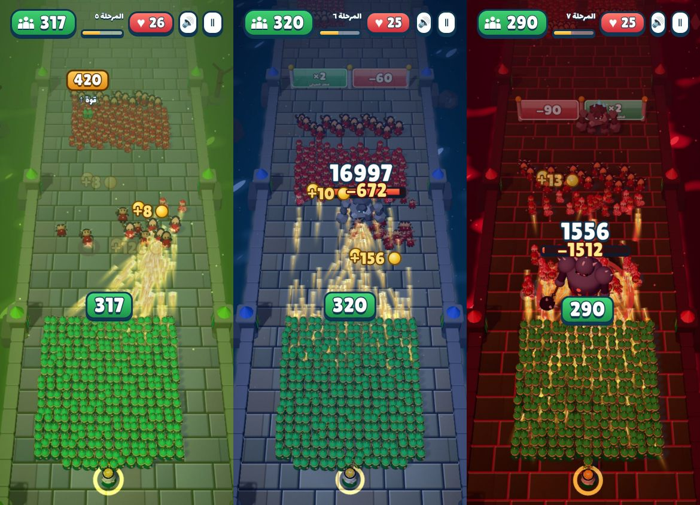

- **Music and sound** (`src/core/Audio.js`): everything is synthesised with the Web Audio API, so there are no audio files. The music is a D-minor battle loop with taiko drums, bass and a string ostinato; a brass lead joins while a giant is on the field. Sound effects cover arrow volleys, hits, kills, enemy arrows, metal clashes when a walker hits the line, gates, barrels, coins, giant roars, castle breaches, thunder and victory/defeat fanfares. All are throttled for large fights. There is a mute button in the HUD and the start menu, remembered per browser.
- **Rewards and abilities** (added 2026-09-28):
  - **Power barrels**, coloured by type: ❄ freeze (enemies at 30% speed for 5 s), 🔥 fire arrows (double damage for 8 s, orange tracers), 🛡 shield (7 s with no losses at the line and no castle damage, shown as a dome over the army), ⚡ lightning (beams strike the 14 strongest enemies).
  - **Treasure chests** 💰: coins, multiplied by the stage coin scale.
  - **Arrow rain**: kills charge a button (a grunt gives 1, a brute 4, a beast 25, a boss 40, 100 to fill). Pressing it drops 90 arrows in front of the army; after their flight they hit everything within 6.8 m of the army's lane.
  - **Combo**: chaining kills pays bonus coins at 10/25/50/100/150/200/300.
  - **Stars**: 1–3 per stage by castle hearts left, with 40 × stage coins per new star, shown in the stage picker and on the victory screen.
  - **Daily gift** 🎁: once per day, growing with a streak of up to 7 days.

  These abilities make fights easier, so enemy HP was raised again: the scripted player (which also uses arrow rain) needs upgrade levels 1/2/4/8/9/10/11 for stages 1–7.

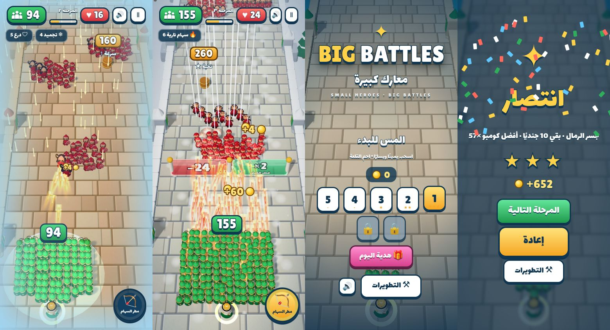

- **Reference look and fixed camera** (added 2026-09-28): the army is now blue with gold trim and red enemies, as in the reference art. Stage 1 is an open lavender-white snow road with pines, and the camera is fixed: it no longer zooms or pans with army size.
- **Weapon rewards** (`src/data/weaponKinds.js`): purple gates and barrels switch the whole army's weapon for the rest of the stage, and soldiers visibly hold it:
  - 🏹 crossbow (default)
  - 🏹 triple bow: three arrows per shot
  - 🎯 rifle: fast white tracers, ×1.8 damage
  - 🔮 magic staff: blue orbs with splash
  - 💣 cannon: arcing shells with fiery splash

  Each weapon has its own projectile, impact effect and sound. Balance with weapons: the scripted player needs upgrade levels 0/2/4/8/9/10/11 for stages 1–7.

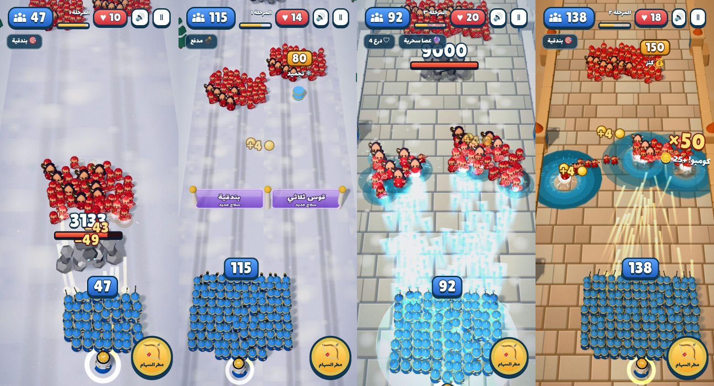

- **Stages 8–12 and new bosses** (added 2026-09-28): 8 كثبان الغروب, 9 نهر الجليد, 10 غابة الأدغال, 11 فوهة البركان, 12 عرش الظلال, each with its own world. Four new bosses (`src/systems/BossSystem.js`) each give a clear ground warning before they strike:
  - 🐉 **Dragon**: hovers at range and breathes fire down a whole lane of the army.
  - ❄ **Yeti**: hurls ice boulders at a circle inside the army.
  - 💀 **Warlock**: stays back and keeps summoning new warriors.
  - 🐘 **War elephant**: charges straight through the line, trampling a lane, then turns back.

  The shield power blocks boss strikes. Stage 12 brings the warlock, yeti, dragon and armoured boss together. Upgrade caps rose to 20 (castle hearts to 15), and costs grow gently after level 10. The scripted player needs levels 0/2/4/8/9/10/11/12/13/14/15/16 for stages 1–12.

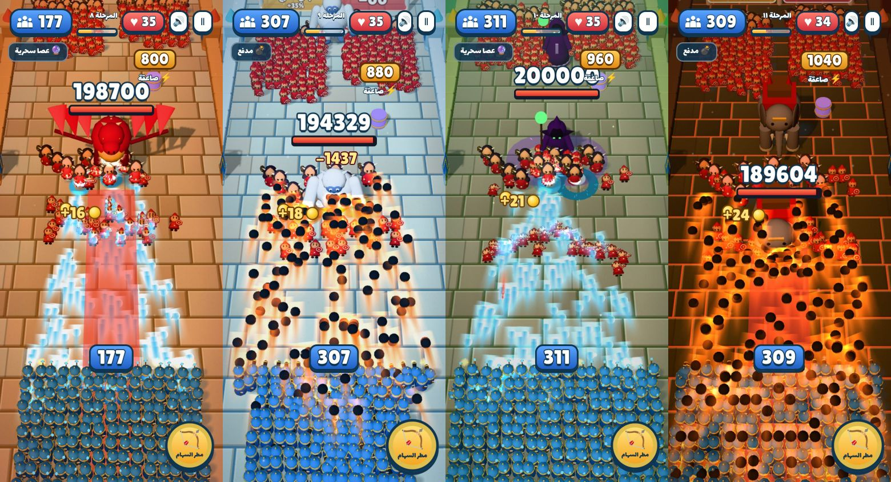

- **Giants and artillery abilities** (added 2026-09-28): two more buttons charge with kills, like arrow rain:
  - 🗿 **Giants**: two blue-and-gold armoured giants step in front of the army for about 16 s. They smash nearby enemies and block walkers, which die on contact while the giant absorbs the hit.
  - 💣 **Artillery**: two cannons at the road edges fire explosive shells at the front of the horde for about 12 s.

  A new shop upgrade, ✨ **ability power**, raises the damage and duration of arrow rain, giants and artillery. Stage 7 was eased by about 20% after feedback. The scripted player (using every ability) now needs levels 0/1/3/6/8/9/9/11/12/12/14/15 for stages 1–12.

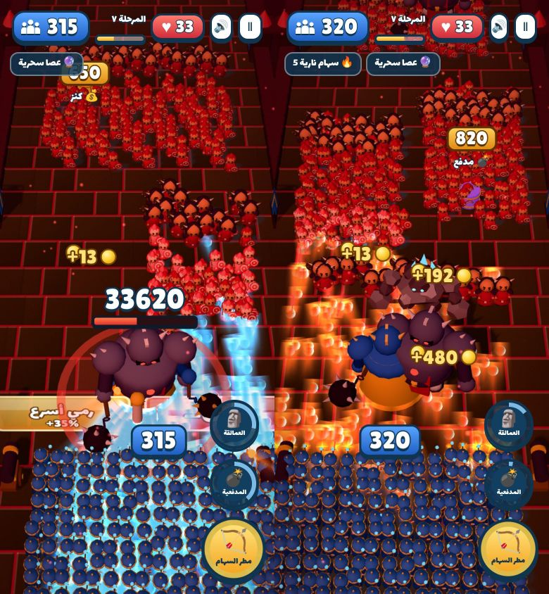

- **Hold to shoot** (added 2026-09-29): soldiers fire only while the player keeps a finger (or the mouse button) on the screen. Dragging steers as before, and lifting the finger stops the arrows and shows a "hold to shoot" hint. Abilities and enemy archers are unaffected.
- **Clash effects**: when a walker reaches the line, a white-gold burst with fast metal sparks appears, and a brute adds a camera kick.
- **Feedback effects**: damage numbers over giants, coin pop-ups for brutes and giants, dust rings where units fall, bigger barrel bursts, a glowing ring under the commander, stage/wave/boss announcement banners with camera kick, a themed vignette and victory confetti.
- Also fixed: a stage could end as a victory while a gate or barrel was still approaching.

Validation: 46 Node tests pass (7 new: fixed line, rising difficulty, gate charging/negative gates, barrel rewards and castle breaches, brute trades, save/load, brute instancing). Both modes load in headless Chromium without errors. Phone FPS is still unmeasured.

## Arcade look — 2026-09-28

The default appearance is now a bright arcade army-runner style modeled on the supplied reference screenshots: chunky chibi soldiers, a dense crowd, glowing bolt tracers, glassy number gates, floating army/enemy counters and a boss health number. The player identity stays green/gold with a ghutra detail; enemies stay red. The earlier looks remain available: `?classic=1` (original) and `?quality=1` (the Sept 27 study).

| Battle | Beast | Final wave | Boss |
| --- | --- | --- | --- |
| 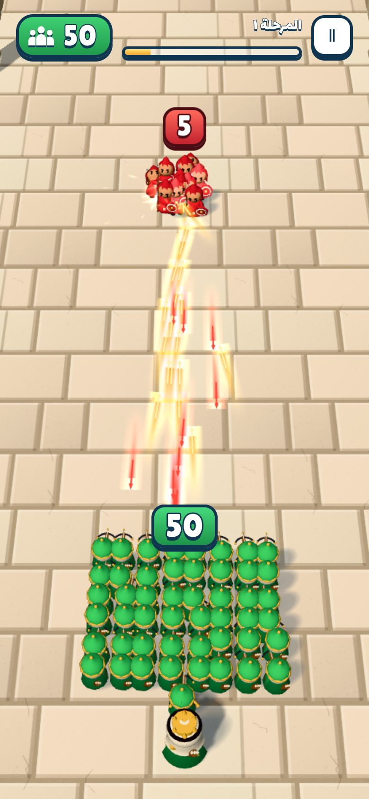 | 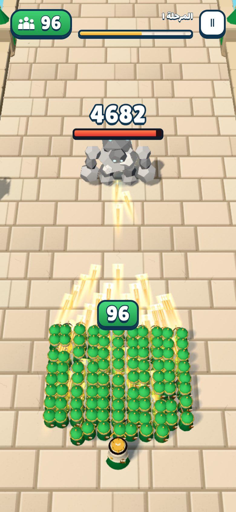 | 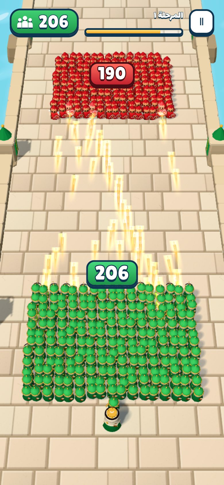 | 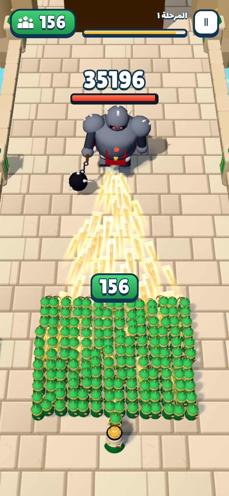 |

- **Characters** (`src/rendering/ChibiFactory.js`): all six characters are built procedurally from smooth primitives and baked into shared pose frames (idle/run/shoot/hit/death; giants add walk/attack). No GLB is downloaded. Crowd soldiers are 1,015–1,378 triangles, commander 2,542, rock golem 632, armoured boss about 3,000. A toon rim shader separates neighbours in a packed crowd; per-unit offsets break the grid.
- **Stage** (`ArcadeEnvironment.js`): sandstone causeway over an animated sea shader, stone parapets, pillars with green banners, piers, rocks and a red-roofed fortress gate. The paving is one runtime canvas texture.
- **Camera/lighting**: steep 54° close framing that fits the army, both gate lanes and the giants; one sun shadow map follows the army (heroes and giants cast real shadows, the crowd uses soft instanced blobs).
- **Effects** (`ArcadeEffects.js`): bolts with saturated tracers and additive halos, muzzle stars, impact flashes with sparks, red telegraph ring that fills during the wind-up, light camera shake when a giant dies.
- **UI**: bundled Lilita One and Lalezar fonts (SIL OFL, licences in `assets/fonts/`), outlined arcade HUD, world-pinned army/horde/boss tags, gate pop feedback.
- **Pace**: forward speed 4.6 → 6.2 m/s, enemy waves advance faster, and soldiers fire more often with proportionally lower damage (similar DPS). All 128 gate routes still terminate: 99 victories / 29 defeats (was 100/28).
- **Bug fix**: a unit could keep ~1e-15 HP after floating-point damage, never be targeted again and stall a wave. Near-zero health and reservations now clamp to zero.

Validation: all 39 Node tests pass, including new checks for chibi clips/budgets, 320 + 420 instanced procedural units, boss wind-up/strike frames and arcade camera containment. The screenshots above were rendered in headless Chromium with SwiftShader (software WebGL), so they show the real renderer but say nothing about phone FPS. The 320-player vs 190-enemy case draws about 690k triangles in 27 draw calls; **real iPhone/Android frame rates are still unmeasured**.

**Previous status:** Stage 1 completes in simulation, and all six animated **prototype** GLBs are integrated. The recruit is an improved modeled draft made in Higgsfield 3D Jutsu; the other five retain their existing procedural shapes. These are not final artwork matching the approved illustrations. Real Safari/Android visual playback and FPS remain unverified: the available cloud browser disables WebGL.

**Quality study, September 27:** [Open the experimental visual profile](https://3wasfnjd.github.io/BIG-BATTLES/?quality=1), or keep the original appearance by omitting `quality=1`. This study uses the same Stage 1, combat, army counts and gates. It adds closer adaptive framing, chamfered stone paving, soft directional footprint shadows, modified lighting/tone mapping, MSAA when supported, clearer tracers/impacts and bounded muzzle flashes. The start-screen preview loads this profile's candidate recruit. [Arabic assessment, production route and acceptance criteria](docs/QUALITY-PLAN-AR.md).

The candidate has 3,384 triangles, one material, no textures, seven rigid joints, five clips and a 263,560-byte GLB. Its revised cloth/back equipment and baked vertex occlusion were inspected in actual Blender renders. **It is still below the requested reference quality and is not accepted as final character art.** No other character has been rebuilt for this study, and LOD is not implemented. The source, renders and production brief are kept under `art/`; none of those source images are downloaded by gameplay. Only the experimental URL requests the extra GLB. `npm run models:quality` repackages the committed source reproducibly.

Validation: all **36 Node tests** pass, including camera containment at four aspect ratios and both corridor edges, actual candidate GLB/clip parsing, instanced crowd replacement, constant environment geometry at four times the stage length, and 740 bounded muzzle flashes. `node tools/benchmark.mjs --quality` ran 50+50, 100+100, 200+200, 320+320 and 320+420 units. The final case measured **0.442 ms median / 1.072 ms p95 CPU simulation+scene updates**, with no projectile misses; cosmetic effects saturated under heavy stress. [Raw results](docs/quality-validation-2026-09-27.json). These measurements exclude GPU drawing, MSAA, browser overhead and gate canvas text. Real phone FPS is still unknown.

## Play / develop

[Play BIG BATTLES](https://3wasfnjd.github.io/BIG-BATTLES/)

GitHub Pages serves `main` directly. WebGL 2 and ES modules are required. All runtime dependencies/assets are self-hosted. There is no bundler or CDN. Run `npm run release` after changing runtime files and before publishing; it stamps a content-derived release into the static HTML and import map.

```sh
npm run serve       # http://localhost:8080 (Python 3)
npm ci              # development dependencies; Three.js pinned to 0.180.0
npm run release     # stamp asset/module versions after runtime changes
npm test            # verify release freshness, gameplay and all 128 gate paths
npm run benchmark   # CPU/scene update stress harness; NOT GPU FPS
npm run models      # rebuild prototype GLBs, then package the inspected recruit source
npm run vendor      # copy pinned Three.js distribution to vendor/
```

Drag anywhere to steer. Reversing a drag responds immediately even after reaching the corridor edge. The army's front center marker chooses the gate even when the crowd spans both lanes. HUD: army size, progress, pause; a boss bar appears only for the final fight. Switching tabs pauses play. Pause freezes simulation, visual animation, effects and camera movement. Victory/defeat has one replay button.

The start screen now has a temporary **معاينة الجندي** (soldier preview) button. It opens the actual `recruit.glb` in a close-up with idle animation; drag horizontally to rotate and use **عودة** to return. This inspects the current draft, not a new model or a concept illustration. The viewer shares the existing renderer and asset cache, clones just one rig, and does not start the stage or change the army. Its camera fits portrait/landscape screens with room for the controls. Failed loads keep the back button available and can be retried by reopening.

## What existed and what changed

The existing implementation already had a modular renderer-independent simulation, one data-driven stage, seven gate pairs, formations, automatic projectiles, five encounters, a fictional desert fortress, simple UI, instanced procedural characters, a GLB adapter, and 12 Node tests. These systems were retained.

This update fixes elite upgrades that retained recruit range/projectile speed/radius, transient idle/shoot states while running, stalled touch reversal at the movement boundary, and animation continuing behind the pause overlay. New recruits enter near their slots; formation and casualty compaction preserve array identity and corridor bounds.

Shared targeting now reserves in-flight damage, checks front-line candidates reliably and refreshes immediately on population changes. Fewer soldiers waste a volley on an already-covered target. Pools retain diagnostic misses/peaks after a result rather than resetting the evidence. The beast and boss use explicit walk/attack states. Dead characters leave combat immediately and play a bounded visual death animation (maximum 32 bodies).

Six actual GLBs now replace the placeholders lazily. Ordinary soldiers share baked animation poses and InstancedMesh batches. Only the commander, beast and boss have individual mixers. Compatible body/weapon geometry sharing a material is merged, and only populated instance ranges are uploaded. Failed loads retain procedural visuals.

## Stage 1 — حصن الرمال

`src/data/stage1.js` is the source of truth for initial size, distances, gates and encounters:

1. Six starting heroes; +5/+10, then +10/×2.
2. 16-enemy guard wave.
3. Weapon/fire-rate choice; +20/×2.
4. 48-enemy battalion.
5. Elite conversion/damage choice; Desert Beast.
6. +20/×3, then ×2/+20.
7. 190-enemy fortress army; Giant Boss; victory at the end of the path.

Beast/boss encounters pause forward progress but keep sideways control. Red floor telegraphs precede melee attacks. Every third boss attack is a wider smash. Death, defeat, pause and replay are supported. The first stage has no new menus and no additional stages.

There are 128 possible gate routes. Automated fixed-lane strategies produced 100 victories and 28 defeats; no route stalled. These are deterministic control policies for regression testing, not estimates of human win rates. Weak gate combinations can lose. Human playtesting is still needed for balance and fun.

## Characters and approved identity

[Detailed asset inventory and import contract](assets/models/README.md)

| Character | Current file | Runtime animation |
| --- | --- | --- |
| Commander | `assets/models/commander.glb` | Individual rig/mixer |
| Recruit | `assets/models/recruit.glb` | Shared instanced poses |
| Elite | `assets/models/elite.glb` | Shared instanced poses |
| Enemy grunt | `assets/models/enemy-grunt.glb` | Shared instanced poses |
| Desert Beast | `assets/models/desert-beast.glb` | Individual rig/mixer |
| Giant Boss | `assets/models/giant-boss.glb` | Individual rig/mixer |

The supplied reference ZIP contained concept images, prompts and specifications, **no finished GLBs**. The committed files are reproducible procedural prototypes: 578–2,640 triangles each, one material, zero textures, 666.4 KiB total. Every humanoid supports idle/run/shoot/hit/death; beast/boss support idle/walk/attack/hit/death. Weapons and commander cape are separate mesh objects in the source GLB. The player team uses green/tan following the approved palette change on 2026-09-27; this supersedes the blue in the original reference pack. The current GLBs and procedural fallbacks share the green uniform, face covering, cape and rifle accents. Friendly banners, gates, effects and HUD follow the same palette. Red/black enemies, shemagh/ghutra/goggles and the rocky beast retain their identity. The simple geometric models do not match the reference illustrations' production quality. The recruit now uses a 2,640-triangle draft with modeled ghutra, eyes, clothing and a separate rifle, created with scripted Blender geometry in Higgsfield 3D Jutsu. It was not generated by Meshy. The game export has a seven-joint rigid rig and five clips, reuses the existing instanced pose system and weighs 204,764 bytes. The other five characters retain their previous shapes. [Production source and reproduction steps](art/README.md).

Replace a model at its current path and adjust `modelScale`, `rotationY`, `offsetY`, `mode` or clip mappings in `src/data/characters.js` if needed. Set `modelUrl: null` to retain the procedural fallback. Replacing visuals never changes health, weapons, formations, gates or AI. Only assets explicitly marked as these prototypes use simplified Lambert materials; final imports preserve their materials.

## Architecture

| Area | Responsibility |
| --- | --- |
| `src/core/Simulation.js` | Renderer-independent gameplay, lifecycle, peak/kill tracking |
| `src/core/Game.js` / `GameLoop.js` | Three.js scene, fixed-step loop, UI, pause/context lifecycle |
| `src/entities/` | Gameplay data; no meshes or renderer dependency |
| `src/systems/` | Movement, formation, gates, lane-based targets, pooled projectiles, enemy state machines and stage progression |
| `src/rendering/CharacterVisualFactory.js` | Lazy GLB/fallback replacement, instanced pose batches, bounded death playback |
| `src/rendering/CharacterPreview.js` | Temporary start-screen recruit close-up, isolated rig, drag rotation and responsive framing |
| `src/core/AssetManager.js` | Cached GLB parsing, material grouping, shared pose baking, singular animation clips |
| `src/rendering/EnvironmentFactory.js` | Nine reusable instanced corridor pieces: path, wall, tower, two banners, palm, supplies, torch and sandstone |
| `src/data/` | Character stats/visual contract, weapons, Stage 1 sequence |
| `tools/` / `tests/` | Reproducible model generation, CPU stress harness, regression checks |

Simulation advances along +Z; rendering maps progress to -Z. Decorative architecture has no physics dependency. Encounter activation, attacks and gate rewards remain data-driven. The environment is fictional, not a copied landmark; emblems are original geometric marks.

## Performance strategy and measurement

- Caps remain **320 player soldiers / 420 enemy grunts**; Stage 1's largest actual wave is 190.
- One crowd instance batch per active sampled pose/material, not a scene or skeleton per soldier. Run clips use eight shared poses; closeups will show stepped motion. Singular heroes/monsters animate continuously.
- Nine targeting lanes refreshed around 8 Hz plus roster changes; bounded candidate probes and damage reservations. No per-unit pathfinding, raycasts, physics engine or ragdolls.
- 1,200 pooled projectiles; 100 pooled hit/death effects. Cosmetic effects can be dropped at saturation; that never removes damage or changes combat. Heavy sustained stress reaches this visual-effect cap.
- Shared geometry/materials, nine instanced corridor templates and a single final fortress, blob shadows, no shadow maps/postprocessing/large textures. Corridor geometry is generated locally: no environment GLB or texture downloads.
- DPR starts at ≤1.5 and reduces after sustained slow frames. Debug FPS uses real frame intervals, without clipping long stalls.
- Three.js 0.180.0, MIT license at `vendor/LICENSE`. No new runtime dependency.

Diagnostics are off by default. Open `?debug=1` for FPS, frame p95, DPR, units, projectiles/peak/misses, draw calls/triangles, model status and stage state. `?debug=1&portrait=1` limits the desktop surface to 430px for layout review; it is not phone emulation. There are no mutable game globals or cheats.

Validation on 2026-09-27:

- **25 tests pass**, including actual committed GLB parsing/skinning/clips, crowd replacement, missing-model fallback, gate upgrades, damage reservations, controls, death/pause/reset logic, boss attacks, and camera containment at portrait/landscape ratios.
- All 128 gate routes terminate within 145 simulated seconds. Growth route: 85.5 seconds, peak 320, 311 survivors; alternate route: 86.5 seconds, peak 206, 189 survivors. Timings/counts are simulation results and can vary slightly with shot staggering.
- Progressive sustained CPU/scene tests: 50+50, 100+100, 200+200, 320+320, and **320+420 = 740 simultaneous units**. Tests use actual GLB poses and raised health to retain the stress population. No projectile pool misses in any case.
- Largest stress case: median CPU simulation+scene-update **0.377 ms**, p95 **0.684 ms** on the recorded Linux/Node host. These exclude GPU drawing, gate canvas textures and browser overhead; they **cannot be converted into phone FPS**. [Raw method, host and results](docs/validation-2026-09-27.json).
- The actual GLB front/back geometry was inspected through offline CPU projection/rasterization; rigs were also numerically evaluated through every clip. This is not verification of browser-rendered animation quality.
- Available cloud Chrome reports `GL_RENDERER = Disabled` and fails context creation. Actual WebGL frames, device FPS, real browser touch gameplay and replay interaction could not be tested. No Safari/Android performance claim is made.

## Reusable corridor update — 2026-09-27

The route uses contiguous 16 m road pieces and 8 m wall pieces. Towers, palms, supplies, torches and cliffs share template geometry/materials; deterministic placement, height and rotation variations keep the original Najdi/desert character. Only a moving window is submitted through InstancedMesh; instance buffers change when the army crosses a 16 m boundary, including replay back to the start. The fortress remains a single separate mesh.

Measured unique environment geometry buffers dropped from **4,020,332 to 77,252 bytes (98.1%)**. Current GPU instance buffers add 15,616 bytes for Stage 1. These are raw geometry/instance buffers, not total process memory, transfer sizes or FPS. The same geometry bytes are retained at 270 m and 1,080 m stage lengths. The nine piece types bound the environment to nine instance batches plus ground/fortress; this trades a few additional draw calls for much less duplicated geometry. No gameplay distances, gates or encounter placements changed.

Two added tests cover memory scaling, road continuity, instance capacity, visibility, replay and avoiding redundant per-frame matrix uploads. All 25 tests pass. The new 740-unit CPU run measured 0.390 ms median and 0.808 ms p95, with no projectile misses; this remains a Linux CPU-only measurement with no phone FPS claim. [Raw corridor measurements and stress results](docs/corridor-validation-2026-09-27.json). The old CPU timings above are the earlier baseline, not results for this revision.

## Remaining work / exact next step

**Next: test one complete growth-route run on an actual iPhone in Safari with `?debug=1`, record FPS/frame p95 at 50, 100, 200 and 320 soldiers, check gate readability and drag reversal, pause/resume and replay, then repeat on Android.** Use +10 → ×2 → weapon → ×2 → elite → ×3 → ×2 to exercise the maximum army. Tune draw/pose/DPR budgets from these device measurements before increasing crowd limits.

Final concept-matched character art, full production rigs and smooth GPU crowd skinning remain future work. There is no audio yet. Stage 1 is functionally complete in simulation, but it has not received a verified mobile visual/playability pass; it should be treated as a playable prototype, not a finished release.

## Browser cache and publishing

GitHub Pages currently serves files with a ten-minute browser cache. The release script versions the stylesheet, icon, entry module, every local JavaScript module (including relative dependencies and Three.js addon aliases), and GLB requests. Merely changing the entry-module URL does not refresh its dependency graph; the explicit import map keeps one consistent release. No service worker, cache-clearing loop or automatic mid-game reload is added.

After runtime edits, run `npm run release`, then `npm test`, commit the generated `index.html` with the changed sources, and publish `main`. The release command prints a `?v=...` launch URL for users who still have an older document cached. `npm test` rejects a stale release stamp. The optional debug HUD shows `Build ...`; ordinary gameplay gains no additional UI. Two cache regressions bring the suite to 27 tests.

The temporary preview adds four regressions (31 total): the actual recruit's vertices stay within the camera at five aspect ratios through a full rotation; its rig does not mutate the cached model; close/reopen during loading and failure/retry preserve the start state; drag, second-finger rejection, cancel and back release pointer capture. Lifecycle/input checks use a minimal DOM test fixture, and geometry checks use Three.js in Node. These are not a WebGL or physical touchscreen validation; the browser limitation above still applies.
